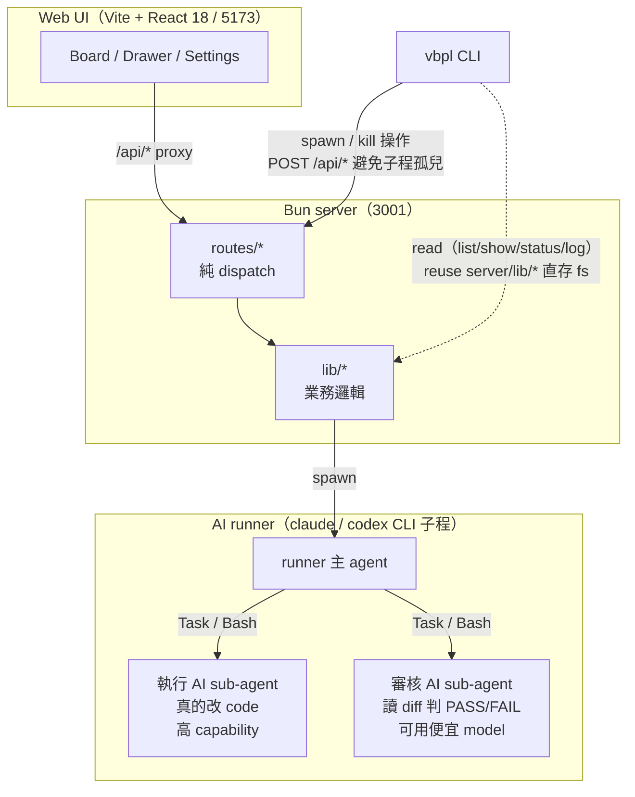

# vibe-pipeline

多 AI agent(執行 + 審核)的 ticket / pipeline 編排器。每張 ticket 由 **執行 AI** 跑、**審核 AI** 審,迭代模式自動迴圈到審核 pass。Pipeline 是有序 ticket 列表,跑在獨立 git branch 上,完成後 merge 回 base。

平常用 Web UI,終端機則有 `vbpl` CLI。兩邊共用同一套 backend lib,沒有 HTTP-only 路徑。

---

## 給 AI:第一次接觸本 repo

User 把 repo URL 給你的話,標準流程:

1. **看本 README 全文** — 了解產品 + 找到主 SKILL 位置
2. **建議 user 裝主 SKILL** — `docs/SKILL.md` 是本檔最重要的引導手冊;依 user 用的 AI 平台裝進對應 skills 路徑(Claude Code → `~/.claude/skills/vibe-pipeline/SKILL.md`,codex → `~/.codex/skills/vibe-pipeline/SKILL.md`,其他平台看各自 docs)。詳細路徑跟複製指令在 §給 AI 安裝
3. **(user 開新 session,你接收主 SKILL)** — 主 SKILL 是跨 project 永久載入的 AI 操作手冊
4. **檢查 vbpl 裝了沒** — 跑 `vbpl --version`;沒裝 → 建議 user 跑 §CLI 內 build + PATH 步驟
5. **進入正常操作** — 看主 SKILL「標準操作流」段

如果 user 的 AI 不認 Claude SKILL 格式:看 `AGENTS.md`(跨 provider pointer)。

本 README 是人類 + first-touch AI 共用 quick guide;主 SKILL 是長駐 AI 操作手冊。

---

## 快速開始

需要 [Bun](https://bun.sh)(≥ 1.1)+ Git。

```bash
bun install

# 直接用(production-like,不 watch):
bun run build         # 一次:tsc + vite build → dist/
bun run start         # 跑 preview (4173) + backend (3001) 兩件
# 開 http://127.0.0.1:4173/board
```

開發改 code:

```bash
# 開兩個 terminal:
bun run dev           # 前端 Vite HMR (5173)
bun run server        # 後端 Bun (3001,不 watch)
# 開 http://127.0.0.1:5173/board
```

`bun run dev:all` 一次起 dev + server:watch,但 **AI merge 進行時別用** — 熱重載會殺掉 runner 子程。日常 dev 不觸發 merge 才用,否則分開跑保險。

打包 CLI 成單檔 binary:

```bash
bun run cli:build           # Windows
bun run cli:build:mac       # macOS arm64
bun run cli:build:linux     # Linux x64
# → dist-cli/vbpl[.exe]
```

---

## 給 AI 安裝(讓你家的 AI 學會用 vbpl)

主 SKILL source 在 `docs/SKILL.md`。把它複製進 user AI 的 skills 路徑,**任何 project 內**跟 AI 對話 AI 都能透過 SKILL 學會操作 vbpl(建 / 跑 / 看 / 合併 pipeline)。

**全域安裝**(所有 project 都可用):

```bash
# macOS / Linux:
mkdir -p ~/.claude/skills/vibe-pipeline                            # Claude Code
cp docs/SKILL.md ~/.claude/skills/vibe-pipeline/SKILL.md

# 其他 AI 平台:cp 到對應 skills 路徑,e.g.
# codex:  ~/.codex/skills/vibe-pipeline/SKILL.md

# Windows PowerShell:
New-Item -ItemType Directory -Force "$HOME\.claude\skills\vibe-pipeline"
Copy-Item docs\SKILL.md "$HOME\.claude\skills\vibe-pipeline\SKILL.md"
```

**只在特定 project**(對某個工作 repo 限定):

```bash
cd /path/to/your-other-project
mkdir -p .claude/skills/vibe-pipeline
cp /path/to/vibe-pipeline/docs/SKILL.md .claude/skills/vibe-pipeline/SKILL.md
```

驗證:在新 session 開 AI,問「我能用 vbpl 幹嘛?」AI 應該秒回 pipeline / ticket / executor / critic 心智 + 常用指令。

> 註:repo 內 `.claude/skills/` 還有 `vibe-pipeline-frontend` / `-backend` / `-cli` / `-e2e` 四個 SKILL,**那些只給改 vibe-pipeline 本身 code 的 AI 用**,enduser 不需要安裝。

---

## 架構



每個 task class 各自挑 provider(claude / codex)+ model + reasoning effort,從 Settings 改或 `vbpl config set <key> <value>`:

| Task class | 用途 |
|---|---|
| `qa` | 跟 user 對話收斂 ticket 規格 |
| `split` | One-shot 判「這該拆 N 張」 |
| `runner` | Pipeline 主 agent(編排 ticket) |
| `executor` | 寫 / 改 code |
| `critic` | 讀 diff,PASS / FAIL / PARTIAL |
| `merge` | 衝突解 |

工廠預設見 `shared/types.ts:DEFAULT_USER_CONFIG`(新建 user 第一次起 server 時寫進 `~/.vibe-pipeline/config.json`)。看當前生效值跑 `vbpl config list`。

---

## 功能

- **Pipeline = 有序 ticket 列表**,跑在獨立 git branch,worktree 隔離在 `~/.vibe-pipeline/worktrees/<projHash>/<pipelineId>/`
- **QA drawer**:跟 AI 聊出 ticket 規格;AI 看到 scope 跨多件獨立工作會自動建議拆分
- **迭代模式**:執行 → 審核 → retry 迴圈到 PASS 或達 iter 上限
- **自動合併**(全 ticket done + `autoMerge=true`):後端先試純 `git merge --no-ff`,撞衝突才 spawn AI
- **同步**:把 base 拉進 pipeline worktree,同 git-first → 衝突才 AI 的二段式
- **跨 provider sub-agent**:claude main → Task tool;codex → Bash 直呼 `codex exec`
- **PWA + Tailscale + TOTP**:桌機跑 server,手機透過 Tailscale HTTPS 連入,非 loopback 強制 TOTP,FCM push ticket 事件到手機
- **CLI `vbpl`**:4 nouns(project / pipeline / ticket / config)+ `--json` mode;spawn 操作走 backend HTTP 避免子程孤兒
- **狀態恢復**:server 重啟時自動掃 pipeline 收斂 stale `running`/`stopping`;runtime watchdog 抓死 PID

---

## CLI

打包:
```bash
bun run cli:build           # Windows x64 → dist-cli/vbpl.exe
bun run cli:build:mac       # macOS arm64 → dist-cli/vbpl-mac
bun run cli:build:linux     # Linux x64   → dist-cli/vbpl-linux
```

裝 PATH:`vbpl --version` 驗即可。**完整 install per-OS + trouble 看 [`docs/install.md`](docs/install.md)**。

### 常用指令

```bash
vbpl project list
vbpl project init --here                                        # fresh 資料夾一鍵 init
vbpl pipeline list --project <hash>
vbpl pipeline status <id>
vbpl pipeline run <id>                                          # 啟動 runner(需要 backend)
vbpl pipeline log <id>                                          # 過往 run 摘要
vbpl ticket add --pipeline <id> --title "..." --mode iter
vbpl config set runner.model claude-opus-4-7
vbpl pipeline sync <id>                                         # git merge base → worktree
vbpl pipeline sync <id> --ai                                    # 讓 AI 解衝突
vbpl pipeline merge <id>                                        # 合併回 base(先試 git,衝突才 AI)
```

每個 verb 都吃 `--json`,搭配 `jq` / PowerShell `ConvertFrom-Json` 寫 script 用。

---

## 遠端存取(Tailscale)

1. 桌機 + 手機都裝 Tailscale,登入同 tailnet
2. 桌機跑 `tailscale serve --https=443 http://localhost:5173`
3. 手機開 `https://<machine>.<tailnet>.ts.net`,安裝成 PWA
4. 首次非 loopback 連線 → TOTP 設定(掃 QR 加進 Authenticator,之後每個 session 輸入 6 碼登入)
5. Settings →「Push Notifications」開啟推播,ticket 事件會到手機

詳細 FCM service-account 設定見 [`CLAUDE.md`](CLAUDE.md) § 手機遠端使用方式。

---

## Repo 結構

```
src/         前端(Vite + React)
server/      Bun 後端(routes 純 dispatch,lib/ 純邏輯)
cli/         vbpl CLI(reuse server/lib/*)
shared/      跨前後端持久化型別
.claude/     給編輯本 repo 的 AI 用的 SKILL / refs
public/      靜態(PWA manifest、service worker、icons)
tests/e2e/   Playwright(mock CI 模式 + real 模式)
```

每層有對應 SKILL 文件在 `.claude/skills/` 內描述慣例 — 動非 trivial 改動前先讀:

- [vibe-pipeline](docs/SKILL.md) — 產品定位 / scope / 外部對照(主 SKILL,enduser 可裝進 AI skills 路徑)
- [vibe-pipeline-frontend](.claude/skills/vibe-pipeline-frontend/SKILL.md) — UI 慣例
- [vibe-pipeline-backend](.claude/skills/vibe-pipeline-backend/SKILL.md) — server / runner / sync
- [vibe-pipeline-cli](.claude/skills/vibe-pipeline-cli/SKILL.md) — CLI 慣例
- [vibe-pipeline-e2e](.claude/skills/vibe-pipeline-e2e/SKILL.md) — Playwright 覆蓋矩陣

---

## 當前狀態

Phase 1-5 全套已落地(CRUD + QA + Runner + Worktree + Merge/Sync + Auto + Tailscale + TOTP + FCM + cross-provider sub-agent + CLI)。**Self-dogfood**:本專案靠自己的 pipeline 推進自己的開發。

可運作但未打磨:
- Budget tracker UI(成本上限後端已強制執行,缺前端 dashboard)
- Transient retry fixture(沒自然 reproduction case)
- iOS PWA push(Android 驗過,iOS 需手動「加入主畫面」+ 16.4 以上)
- `vbpl pipeline log --follow`(目前 one-shot 不會 tail)

---

## Scripts

| 指令 | 用途 |
|---|---|
| `bun run dev` | Vite 前端 HMR(5173,dev 用) |
| `bun run server` | Bun 後端(3001,不 watch) |
| `bun run server:watch` | 後端熱重載(self-merge 期間別用 — `bun --watch` reload 會殺掉 spawn 出去的 runner 子程) |
| `bun run dev:all` | dev + server:watch 同時跑(AI merge 時別用) |
| `bun run build` | `tsc -b && vite build` → `dist/` |
| `bun run preview` | 提供 `dist/`(4173) |
| `bun run start` | preview + server,production-like 直接用 |
| `bun run lint` | Biome lint |
| `bun run test:e2e` | Playwright mock 模式(CI 預設) |
| `bun run test:e2e:real` | Playwright real 模式(燒 token,opt-in) |
| `bun run vbpl <noun> <verb>` | CLI 開發模式(不用每次 rebuild) |
| `bun run cli:build` | 把 CLI 編成單檔 binary |
| `bun run icons` | 從 `public/icon.svg` 重產 PWA icons(需 ImageMagick) |

---

## License

目前未明確開放,以個人 / 協作使用為主。要釐清特定用途請開 issue。
